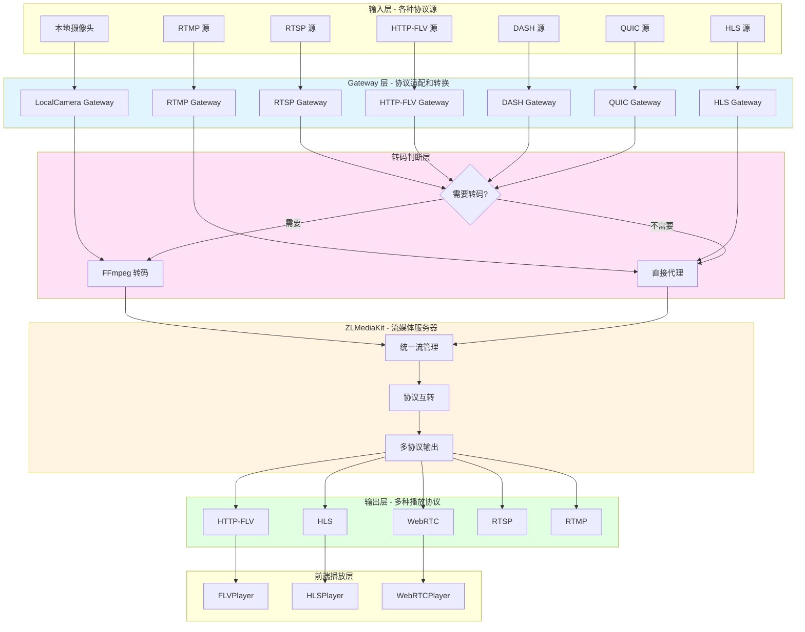
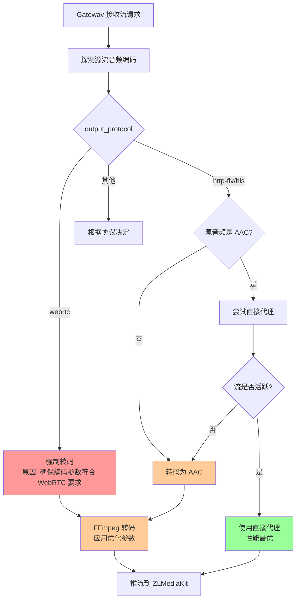
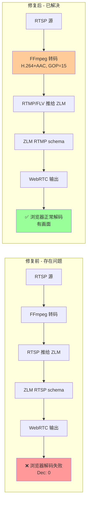
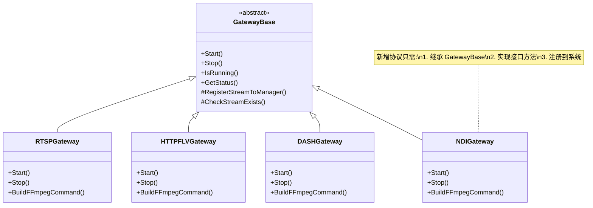

# 项目架构设计说明

## 一、项目背景与核心问题

### 1.1 面临的挑战

在流媒体系统中，我们面临以下核心挑战：

1. **协议多样性**：不同的视频源使用不同的协议（RTSP、RTMP、HTTP-FLV、HLS、DASH、QUIC、ONVIF、ISAPI 等）
2. **编码格式不统一**：不同源的视频编码格式、音频编码格式、GOP 大小、分辨率、码率等参数各不相同
3. **输出需求多样化**：前端需要支持多种播放协议（HTTP-FLV、HLS、WebRTC），每种协议对编码参数有不同要求
4. **兼容性问题**：某些协议组合（如 RTSP→WebRTC）存在兼容性问题，导致浏览器无法正常解码
5. **性能与延迟要求**：不同场景对延迟要求不同（WebRTC 需要超低延迟，HLS 可以接受更高延迟）

### 1.2 传统方案的局限性

**方案 A：直接使用 ZLMediaKit**
- ❌ 只能处理 ZLMediaKit 原生支持的协议（RTMP、RTSP、HTTP-FLV、HLS）
- ❌ 无法处理非原生协议（DASH、QUIC、设备发现协议等）
- ❌ 无法根据输出协议需求智能调整编码参数
- ❌ 无法统一管理所有流的元数据和状态

**方案 B：每个协议单独处理**
- ❌ 代码重复，维护成本高
- ❌ 缺乏统一的接口和状态管理
- ❌ 难以实现智能转码和性能优化
- ❌ 无法统一监控和统计

## 二、我们的架构设计

### 2.1 核心设计理念

我们采用 **Gateway 架构模式**，核心思想是：

> **将所有输入协议统一转换为 ZLMediaKit 可接受的格式，然后由 ZLMediaKit 统一对外提供多种输出协议**

#### 整体架构图



### 2.2 架构层次

#### 架构层次图

```mermaid
graph LR
    subgraph Layer1["第一层: Gateway 层<br/>协议适配层"]
        G1[RTSP Gateway]
        G2[HTTP-FLV Gateway]
        G3[DASH Gateway]
        G4[LocalCamera Gateway]
        G5[设备发现 Gateway]
    end
    
    subgraph Layer2["第二层: ZLMediaKit<br/>流媒体服务器"]
        Z1[流管理]
        Z2[协议转换]
        Z3[多协议输出]
    end
    
    subgraph Layer3["第三层: 前端播放层<br/>播放器适配"]
        P1[FLVPlayer]
        P2[HLSPlayer]
        P3[WebRTCPlayer]
    end
    
    Layer1 -->|统一推流<br/>RTSP/RTMP/FLV| Layer2
    Layer2 -->|自动提供<br/>多种输出协议| Layer3
    
    style Layer1 fill:#e1f5ff
    style Layer2 fill:#fff4e1
    style Layer3 fill:#e1ffe1
```



#### 第一层：Gateway 层（协议适配层）

**职责**：
- 接收各种输入协议
- 智能判断是否需要转码
- 根据输出协议需求调整编码参数
- 统一推流到 ZLMediaKit

**特点**：
- **统一接口**：所有 Gateway 实现相同的接口（`Start()`, `Stop()`, `IsRunning()`）
- **智能转码**：根据源流编码和输出协议需求，智能决定是否需要转码
- **元数据管理**：统一维护流的元数据（app、stream、protocol、output_protocol、status 等）

#### 第二层：ZLMediaKit（流媒体服务器）

**职责**：
- 接收 Gateway 推送的流（RTSP/RTMP/FLV 格式）
- 统一管理所有流
- 自动提供多种输出协议

**特点**：
- **协议互转**：一旦流进入 ZLMediaKit，自动提供 HTTP-FLV、HLS、WebRTC、RTSP、RTMP 等多种输出
- **高性能**：原生 C++ 实现，性能优异
- **成熟稳定**：经过大量生产环境验证

#### 第三层：前端播放层

**职责**：
- 根据流的 `output_protocol` 选择对应的播放器
- 生成对应的播放 URL
- 播放视频流

**特点**：
- **自动适配**：根据流的输出协议自动选择播放器
- **统一体验**：所有流使用统一的播放界面

## 三、架构优势

### 3.1 统一管理，降低复杂度

**问题**：不同协议需要不同的处理逻辑，代码分散，难以管理

**我们的方案**：
- ✅ **统一 Gateway 接口**：所有协议通过相同的接口管理
- ✅ **统一元数据**：所有流的元数据统一存储在 `StreamManager` 中
- ✅ **统一状态管理**：所有流的状态（starting、running、stopping、error）统一管理
- ✅ **统一日志和监控**：所有流的操作都有统一的日志记录和监控

**好处**：
- 代码结构清晰，易于维护
- 新增协议只需实现 Gateway 接口
- 统一的错误处理和重试机制
- 统一的权限验证和访问控制

### 3.2 智能转码，性能最优

**问题**：盲目转码会浪费 CPU 资源，不转码可能导致兼容性问题

**我们的方案**：
- ✅ **智能判断**：根据源流编码和输出协议需求，智能决定是否需要转码
- ✅ **条件转码**：如果源流已经符合要求（如 HTTP-FLV 源音频是 AAC），直接代理，避免不必要的转码
- ✅ **按需转码**：只在必要时转码（如 WebRTC 需要低延迟参数，或音频编码不兼容）

#### 智能转码决策流程图



**示例**：
```
RTSP + HTTP-FLV 输出：
├─ 如果源音频是 AAC → 直接代理（无转码开销）
└─ 如果源音频不是 AAC → 转码为 AAC（确保兼容性）

RTSP + WebRTC 输出：
└─ 强制转码（确保编码参数符合 WebRTC 低延迟要求）
```

**好处**：
- 减少不必要的 CPU 开销
- 降低延迟（直接代理比转码延迟更低）
- 保证兼容性（转码确保编码参数符合要求）

### 3.3 灵活的输出协议支持

**问题**：不同场景需要不同的输出协议（WebRTC 超低延迟、HLS 兼容性好、HTTP-FLV 平衡）

**我们的方案**：
- ✅ **输出协议可配置**：每个流在创建时指定 `output_protocol`
- ✅ **自动适配编码参数**：根据输出协议自动调整编码参数
- ✅ **前端自动选择播放器**：前端根据 `output_protocol` 自动选择对应的播放器

**示例**：
```
同一个 RTSP 源：
├─ output_protocol='webrtc' → 转码为低延迟参数（GOP=15, zerolatency）
├─ output_protocol='http-flv' → 转码为标准参数（GOP=25）
└─ output_protocol='hls' → 转码为标准参数（GOP=25）
```

**好处**：
- 一个源可以同时支持多种输出协议
- 根据场景选择最合适的协议
- 前端自动适配，用户体验好

### 3.4 解决兼容性问题

**问题**：某些协议组合存在兼容性问题（如 RTSP→WebRTC 可能导致浏览器无法解码）

**我们的方案**：
- ✅ **链路优化**：RTSP + WebRTC 改为 RTSP→RTMP→WebRTC 链路，避免 RTSP→WebRTC 的兼容性问题
- ✅ **编码参数优化**：WebRTC 模式使用专门的编码参数（GOP=15, bframes=0, ref=1 等），确保浏览器解码兼容性
- ✅ **统一音频编码**：WebRTC 统一使用 AAC 音频编码，确保兼容性

#### 兼容性问题解决流程图



**示例**：
```
RTSP + WebRTC（修复前）：
RTSP 源 → FFmpeg → RTSP 推给 ZLM → ZLM 从 RTSP schema 导出 WebRTC
❌ 浏览器收包但解码帧数=0

RTSP + WebRTC（修复后）：
RTSP 源 → FFmpeg → RTMP/FLV 推给 ZLM → ZLM 从 RTMP schema 导出 WebRTC
✅ 浏览器正常解码，有画面
```

**好处**：
- 解决了 RTSP→WebRTC 的兼容性问题
- 与本地摄像头 WebRTC 链路保持一致
- 确保所有输出协议都能正常工作

### 3.5 易于扩展

**问题**：新增协议或功能需要修改大量代码

**我们的方案**：
- ✅ **Gateway 模式**：新增协议只需实现 Gateway 接口
- ✅ **统一基类**：`GatewayBase` 提供通用的功能（流管理、状态检查、错误处理等）
- ✅ **插件化设计**：Gateway 可以独立启用/禁用，不影响其他功能

#### 扩展架构图



**示例**：
```
新增 NDI 协议支持：
1. 创建 NDIGateway 类，继承 GatewayBase
2. 实现 Start()、Stop()、IsRunning() 方法
3. 在 http_server.cpp 中注册 Gateway
4. 完成！无需修改其他代码
```

**好处**：
- 新增协议成本低
- 代码解耦，易于维护
- 可以独立测试和部署

### 3.6 设备发现支持

**问题**：手动配置每个摄像头的 RTSP 地址很繁琐

**我们的方案**：
- ✅ **设备发现协议**：支持 ONVIF、ISAPI、Dahua、PSIA 等设备发现协议
- ✅ **自动获取流地址**：自动发现设备并获取 RTSP 流地址
- ✅ **统一管理**：设备信息和流信息统一管理

**好处**：
- 简化配置，提升用户体验
- 支持多种设备品牌和协议
- 自动发现，无需手动配置

### 3.7 性能优化

**问题**：转码会消耗 CPU 资源，影响系统性能

**我们的方案**：
- ✅ **智能码率分配**：根据系统总带宽和流的优先级，智能分配码率
- ✅ **条件转码**：只在必要时转码，减少 CPU 开销
- ✅ **原生协议优先**：优先使用原生协议（直接代理），避免转码

**好处**：
- 最大化利用系统资源
- 减少不必要的 CPU 开销
- 提升系统整体性能

## 四、架构设计原则

### 4.1 单一职责原则

每个 Gateway 只负责一种输入协议的处理，职责清晰。

### 4.2 开闭原则

对扩展开放，对修改关闭。新增协议只需添加新的 Gateway，无需修改现有代码。

### 4.3 依赖倒置原则

Gateway 依赖抽象的 ZLMClient 和 StreamManager 接口，而不是具体实现。

### 4.4 统一接口原则

所有 Gateway 实现相同的接口，便于统一管理和调用。

### 4.5 智能决策原则

根据源流编码和输出协议需求，智能决定是否需要转码，避免盲目转码。

## 五、实际应用场景

### 5.1 多协议视频监控系统

**场景**：需要接入多种协议的摄像头（RTSP、ONVIF、ISAPI 等），并支持多种播放方式

**我们的方案**：
- 使用对应的 Gateway 接入不同协议的摄像头
- 统一转换为 ZLMediaKit 格式
- 前端根据需求选择 HTTP-FLV（低延迟）或 HLS（兼容性好）播放

### 5.2 实时视频会议系统

**场景**：需要超低延迟的实时视频传输

**我们的方案**：
- 使用 WebRTC 输出协议
- Gateway 自动应用低延迟编码参数（GOP=15, zerolatency）
- 确保浏览器解码兼容性

### 5.3 视频点播系统

**场景**：需要支持回放和兼容性好的播放

**我们的方案**：
- 使用 HLS 输出协议
- Gateway 应用标准编码参数（GOP=25）
- 确保 HLS 切片质量和播放兼容性

## 六、总结

我们的架构设计通过 **Gateway 层统一管理所有输入协议**，**ZLMediaKit 统一提供所有输出协议**，实现了：

1. **统一管理**：所有流通过统一的接口和元数据管理
2. **智能转码**：根据需求智能决定是否需要转码，性能最优
3. **灵活输出**：支持多种输出协议，根据场景选择
4. **兼容性保证**：通过链路优化和编码参数优化，确保所有协议组合都能正常工作
5. **易于扩展**：新增协议只需实现 Gateway 接口
6. **性能优化**：智能码率分配和条件转码，最大化系统性能

这个架构设计既保证了系统的灵活性和可扩展性，又确保了性能和兼容性，是一个**平衡了复杂度、性能和功能**的优秀架构。

