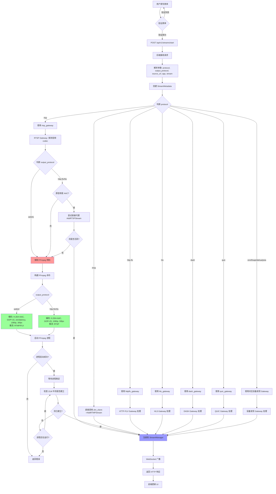
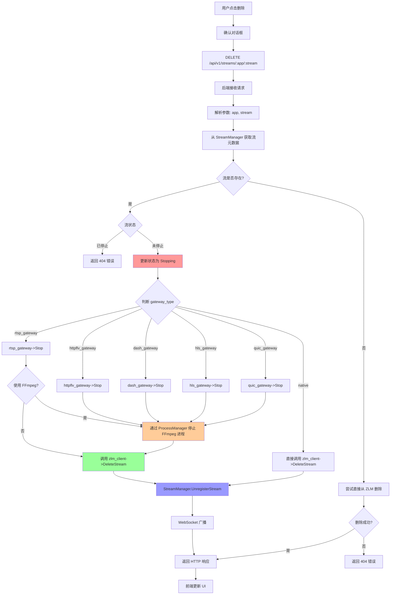
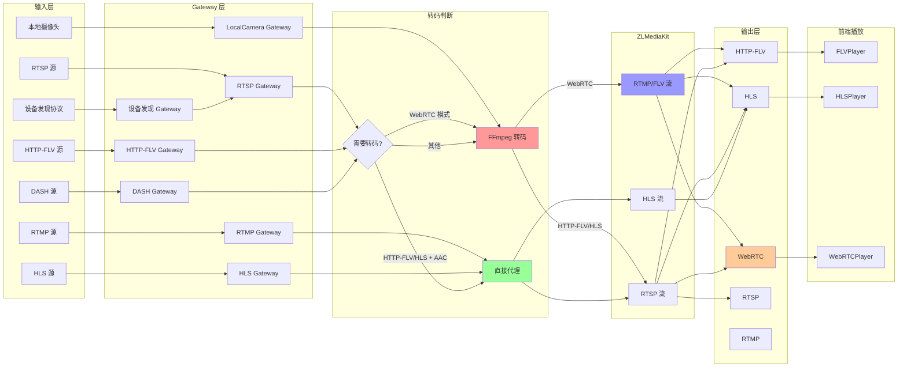
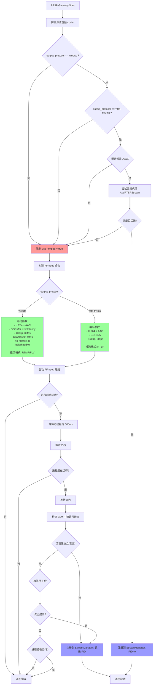
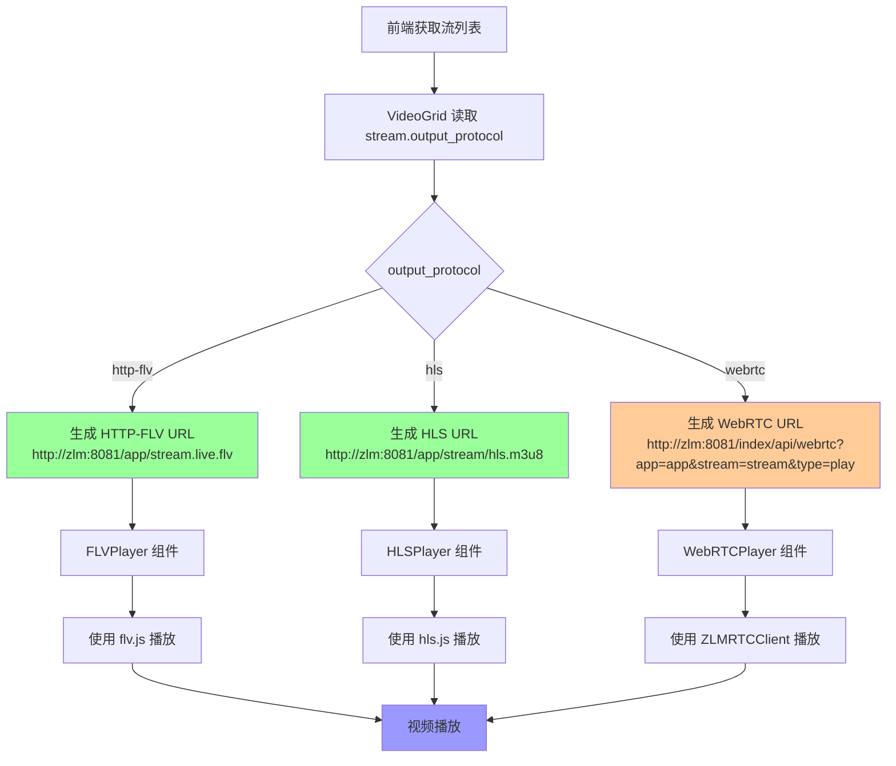
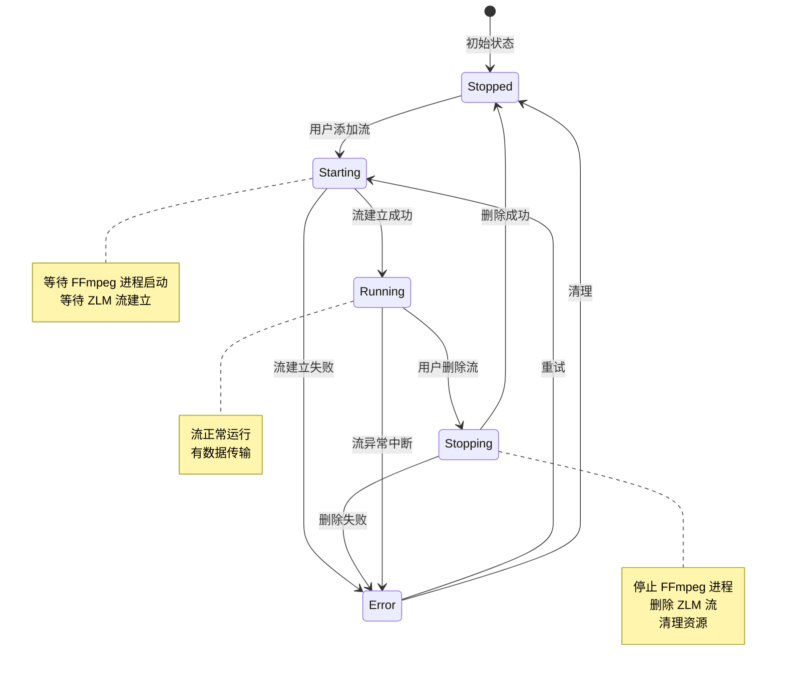

# 系统完整流程图

本文档使用 Mermaid 流程图展示系统的完整逻辑流程。

## 一、添加流完整流程图



## 二、删除流完整流程图



## 三、数据流完整流程图（输入协议 → 输出协议）



## 四、RTSP Gateway WebRTC 模式详细流程图



## 五、前端播放流程图



## 六、关键决策点说明

### 1. FFmpeg 转码判断逻辑

```
RTSP Gateway:
├─ output_protocol == "webrtc"
│  └─ 强制转码 (use_ffmpeg = true)
│     └─ 原因：确保视频编码参数符合 WebRTC 要求
│
└─ output_protocol == "http-flv" || "hls"
   ├─ 源音频是 "aac"
   │  └─ 尝试直接代理 (use_ffmpeg = false)
   │     └─ 如果失败或流未活跃，回退到转码
   │
   └─ 源音频不是 "aac"
      └─ 强制转码 (use_ffmpeg = true)
```

### 2. 推流格式选择

```
RTSP Gateway FFmpeg 转码:
├─ output_protocol == "webrtc"
│  └─ 推流格式: RTMP/FLV (-f flv)
│     └─ 原因：与本地摄像头 WebRTC 链路保持一致
│
└─ output_protocol == "http-flv" || "hls"
   └─ 推流格式: RTSP (-f rtsp)
```

### 3. 编码参数选择

```
WebRTC 模式:
├─ 视频: H.264, preset=veryfast, tune=zerolatency
├─ GOP: 15 (小 GOP，降低延迟)
├─ 分辨率: 1920x1080
├─ 帧率: 30fps
├─ x264 参数: bframes=0:ref=1:no-mbtree:rc-lookahead=0:scenecut=0
└─ 音频: AAC, 128k, 44100Hz, 立体声

HTTP-FLV/HLS 模式:
├─ 视频: H.264, preset=veryfast
├─ GOP: 25
├─ 分辨率: 1920x1080
├─ 帧率: 30fps
└─ 音频: AAC, 128k, 44100Hz, 立体声
```

## 七、状态流转图



## 八、协议转换矩阵

| 输入协议 | 输出协议 | Gateway | 是否需要转码 | 推流格式 | 原因说明 |
|---------|---------|---------|------------|---------|---------|
| RTSP | WebRTC | RTSP Gateway | ✅ 强制 | RTMP/FLV | **必须转码**：1) 确保视频编码参数符合 WebRTC 低延迟要求（GOP=15, zerolatency, bframes=0 等）；2) 统一音频编码为 AAC；3) 推流格式使用 RTMP/FLV 而非 RTSP，与本地摄像头 WebRTC 链路保持一致，避免 RTSP→WebRTC 路径的兼容性问题 |
| RTSP | HTTP-FLV | RTSP Gateway | ⚠️ 条件 | RTSP | **条件转码**：如果源音频是 AAC 且视频参数合适，尝试直接代理（性能最优）；否则转码为 H.264+AAC，统一 GOP=25、分辨率、码率等参数，确保播放稳定性 |
| RTSP | HLS | RTSP Gateway | ⚠️ 条件 | RTSP | **条件转码**：如果源音频是 AAC 且视频参数合适，尝试直接代理；否则转码为 H.264+AAC，统一编码参数，确保 HLS 切片质量和播放兼容性 |
| RTMP | * | Native | ❌ 不需要 | RTMP | **无需转码**：RTMP 是 ZLMediaKit 原生协议，标准 H.264+AAC 流可直接推入，无需额外处理 |
| HTTP-FLV | * | HTTP-FLV Gateway | ⚠️ 条件 | RTSP | **条件转码**：如果源音频是 AAC，直接代理（性能最优）；否则转码为 AAC，确保音频兼容性 |
| HLS | * | HLS Gateway | ❌ 不需要 | HLS | **无需转码**：HLS 是 ZLMediaKit 原生协议，直接代理 HLS 文件/段，无需转码 |
| DASH | WebRTC | DASH Gateway | ✅ 需要 | RTSP/RTMP | **必须转码**：DASH 不是 ZLMediaKit 原生协议，需要 FFmpeg 拉取 DASH 流并转码为 WebRTC 兼容的 H.264+AAC 格式 |
| QUIC | WebRTC | QUIC Gateway | ✅ 需要 | RTSP/RTMP | **必须转码**：QUIC 是实验性协议，不是 ZLMediaKit 原生协议，需要 FFmpeg 转码为 WebRTC 兼容格式 |
| 本地摄像头 | WebRTC | LocalCamera Gateway | ✅ 需要 | RTMP/FLV | **必须转码**：摄像头原始输出需要编码为 H.264+AAC，应用 WebRTC 低延迟参数（GOP=15, zerolatency），确保浏览器解码兼容性 |
| 本地摄像头 | HTTP-FLV/HLS | LocalCamera Gateway | ✅ 需要 | RTMP/FLV | **必须转码**：摄像头原始输出需要编码为 H.264+AAC，应用标准编码参数（GOP=25），确保播放流畅度 |
| ONVIF | * | ONVIF Gateway → RTSP Gateway | ✅ 需要 | RTSP/RTMP | **必须转码**：ONVIF 是设备发现协议，最终获取 RTSP URL，按 RTSP Gateway 规则处理（WebRTC 强制转码，HTTP-FLV/HLS 条件转码） |
| ISAPI | * | ISAPI Gateway → RTSP Gateway | ✅ 需要 | RTSP/RTMP | **必须转码**：ISAPI 是设备发现协议，最终获取 RTSP URL，按 RTSP Gateway 规则处理 |
| Dahua | * | Dahua Gateway → RTSP Gateway | ✅ 需要 | RTSP/RTMP | **必须转码**：大华协议是设备发现协议，最终获取 RTSP URL，按 RTSP Gateway 规则处理 |
| PSIA | * | PSIA Gateway → RTSP Gateway | ✅ 需要 | RTSP/RTMP | **必须转码**：PSIA 是设备发现协议，最终获取 RTSP URL，按 RTSP Gateway 规则处理 |

---

**说明**：
- ✅ 强制：必须使用 FFmpeg 转码
- ⚠️ 条件：根据源流编码决定是否需要转码
- ❌ 不需要：直接代理或推流，无需转码

**转码原因总结**：
1. **协议不兼容**：输入协议不是 ZLMediaKit 原生协议（如 DASH、QUIC），需要转换为原生协议
2. **编码参数不匹配**：源流编码参数不符合输出协议要求（如 WebRTC 需要低延迟参数）
3. **音频编码不兼容**：源音频不是目标协议要求的编码格式（如 WebRTC/HTTP-FLV 需要 AAC）
4. **统一编码标准**：确保所有流使用统一的编码参数（GOP、分辨率、码率等），提升播放稳定性
5. **链路兼容性**：某些协议组合（如 RTSP→WebRTC）存在兼容性问题，改用更稳定的链路（RTSP→RTMP→WebRTC）

