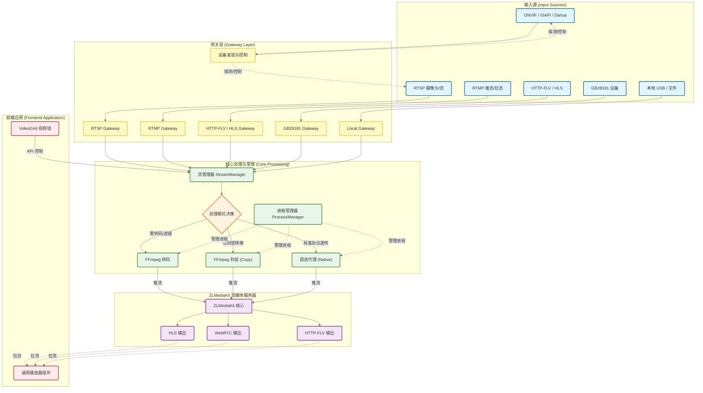
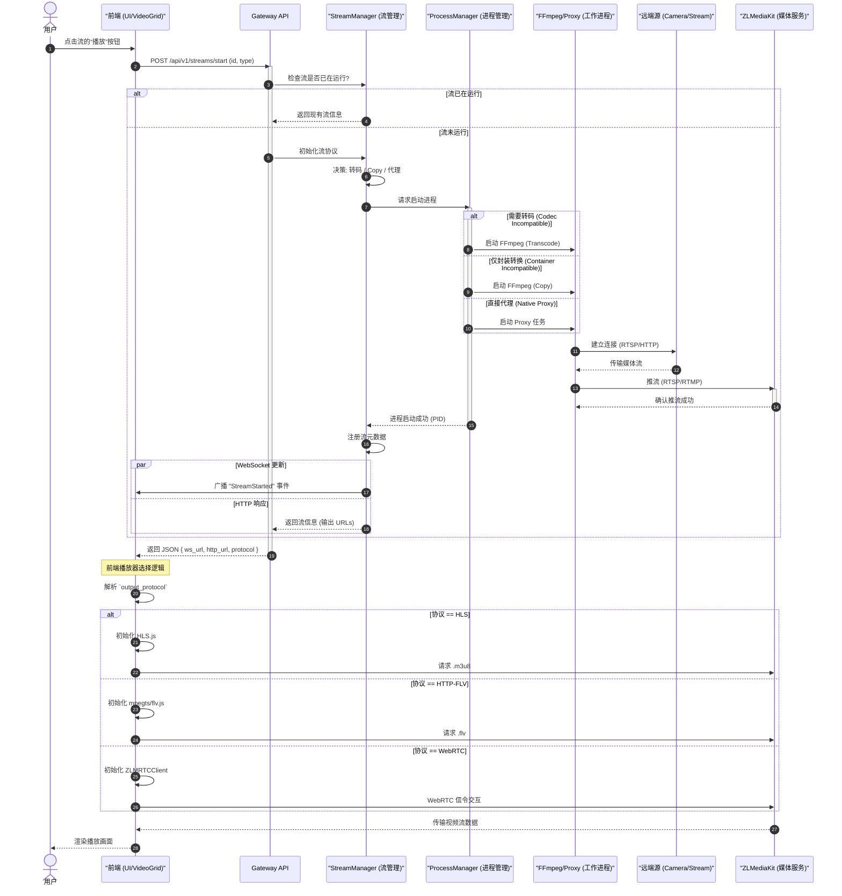
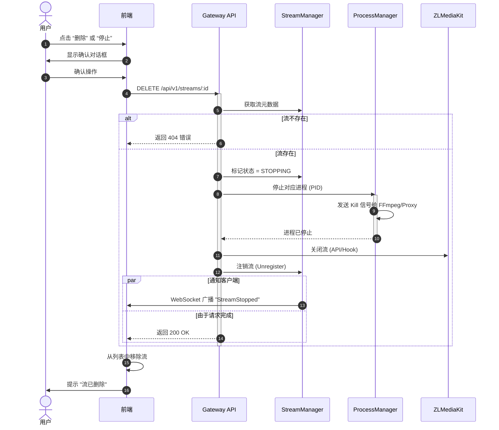
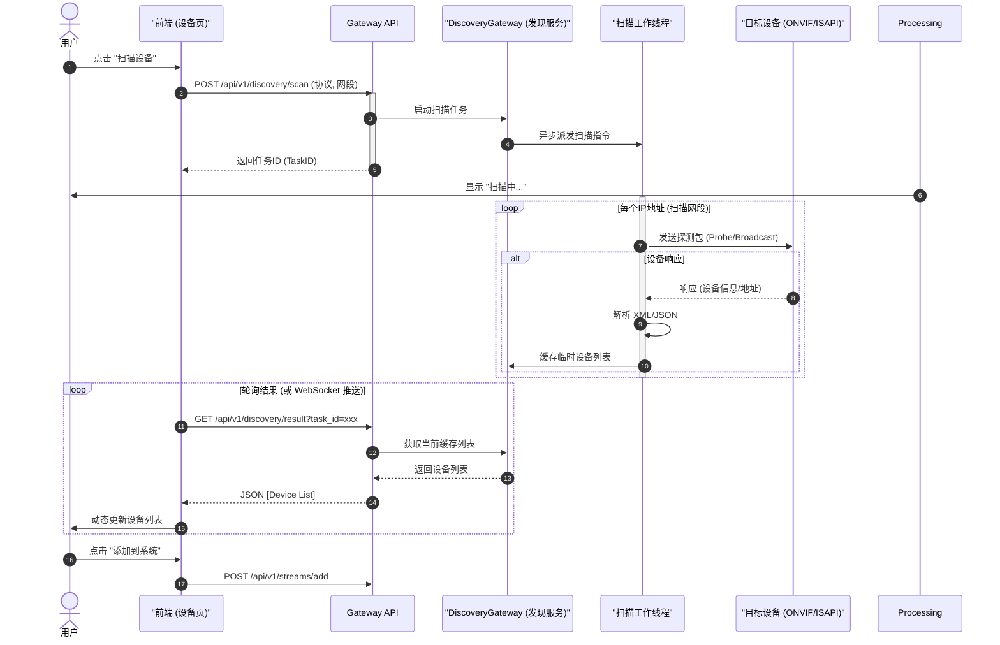
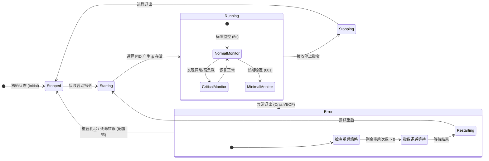

# 优化后的项目架构图 (中文版)

这些图表经过重新设计，旨在提供更清晰、准确且美观的系统架构和工作流视图。它们将之前分散的视图合并为连贯的叙述。

## 1. 系统架构与流摄取管道 (System Architecture & Stream Ingestion)
**变更说明：**
- 将原本横向的“分层”视图（图1）与“转码决策”逻辑（图3）合并。
- 增加了独立的“设备发现”模块，展示其与网关的交互。
- 明确了从 **源 (Source)** -> **网关 (Gateway)** -> **核心处理 (Core Processing)** -> **分发 (Distribution)** 的流向。
- 突出了关键的“转码 vs 代理”决策路径。

## 2. 流启动与播放全流程 (Stream Activation & Playback Sequence)
**变更说明：**
- 将“后端启动流程”（图5）与“前端播放器选择逻辑”（图2）合并。
- 形成了一个从用户点击“播放”到看到视频画面的完整“用户故事”。
- 简化了内部网关的检查细节，但保留了关键的“逻辑分支”。

## 3. 流停止与清理流程 (Stream Termination & Cleanup)
**变更说明：**
- 优化了复杂的“删除流程”（图4）。
- 聚焦于“资源清理”链条：API -> 进程 -> 流注册 -> 通知。
- 将错误处理（404/软失败）隐式处理，不再让主流程显得杂乱。

## 4. 设备自动发现流程 (Device Discovery Workflow)
**新增说明：**
- 补充了项目中关于 ONVIF/ISAPI 等协议的自动发现机制。
- 展示了从前端发起扫描到后端探测网段的异步交互过程。

## 5. 进程保活与监控状态机 (Process Monitoring State Machine)
**新增说明：**
- 描述了 `ProcessManager` 复杂的内部状态流转。
- 展示了系统如何处理异常退出、自动重启以及分层监控策略。

